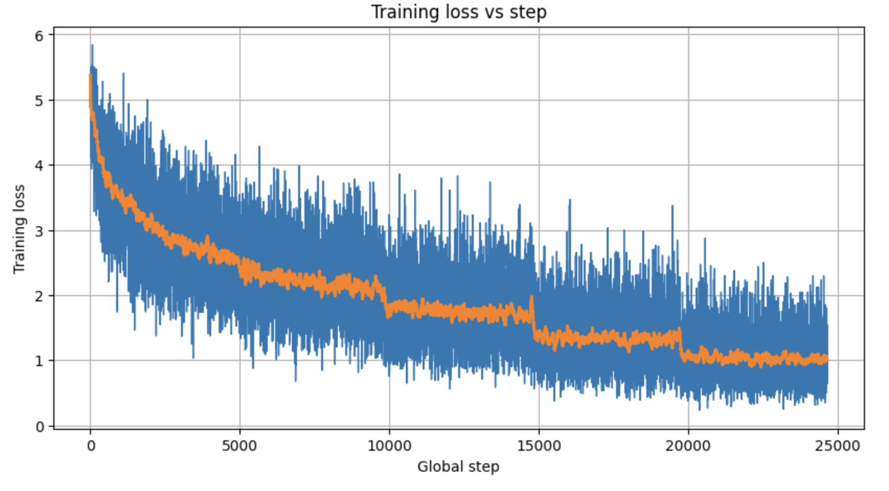
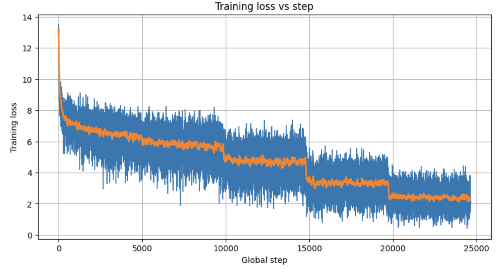
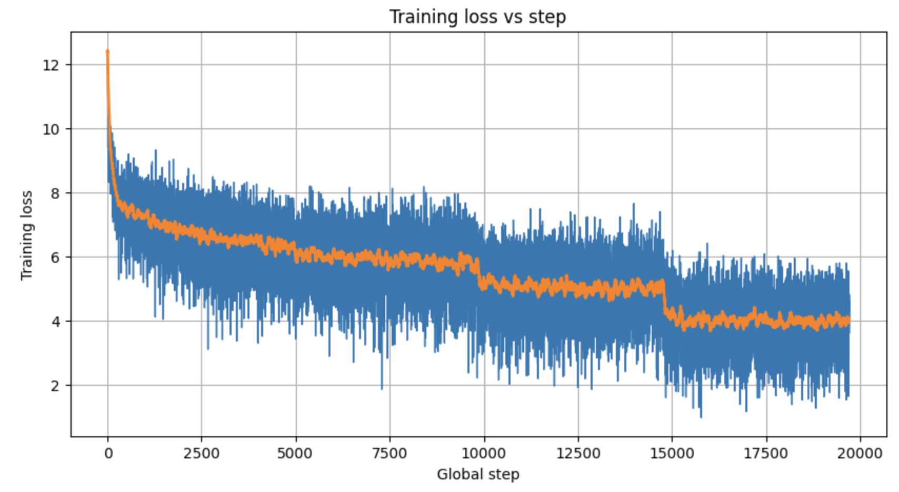
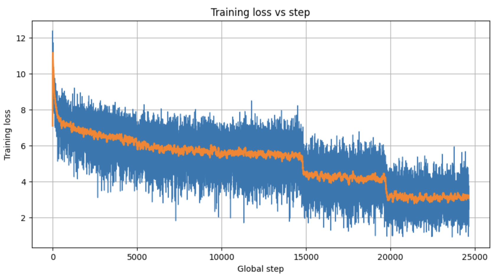
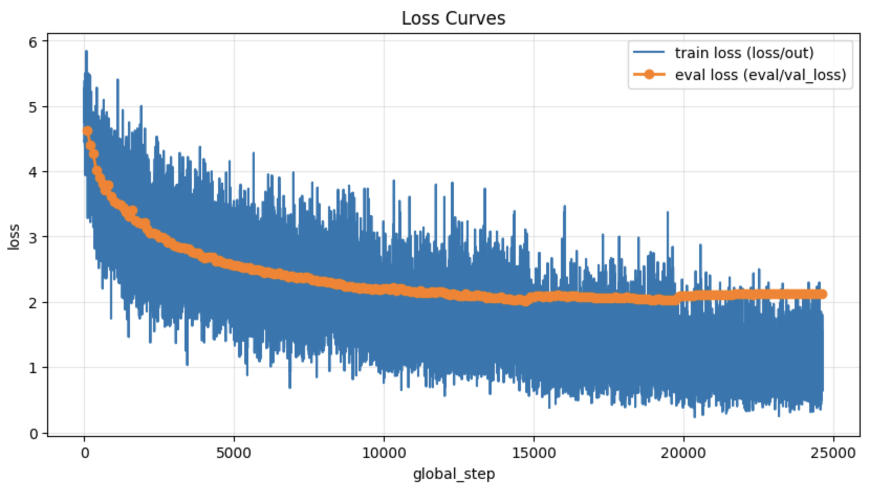
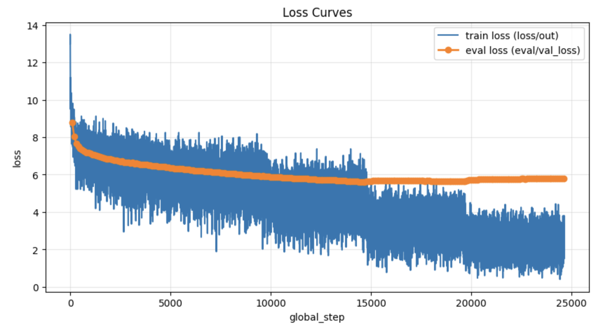
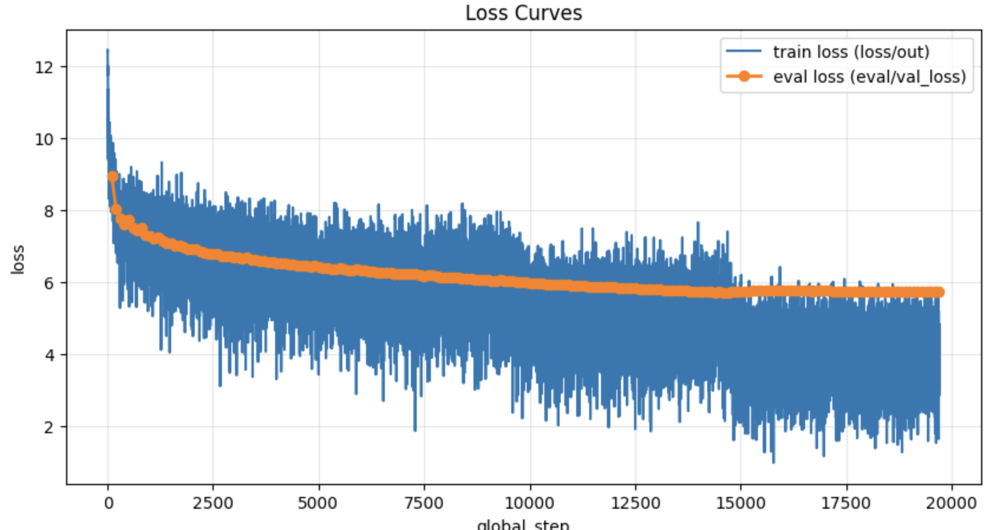
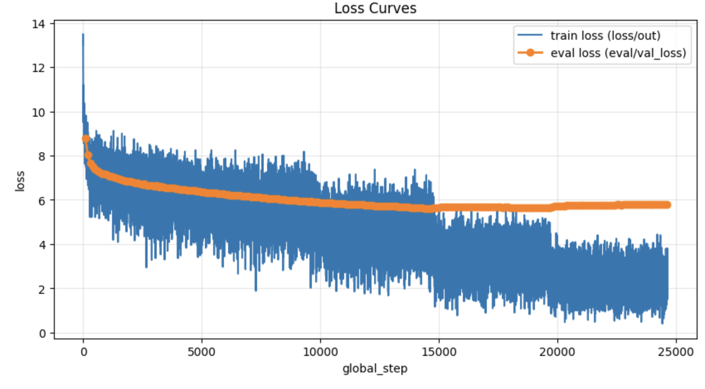

# Encoder-Decoder Extractive Mechanisms: Performance Comparison
**Weekly Update - January 27, 2026**

---

## Executive Summary

This report compares four encoder-decoder architectures for extractive question answering on SQuAD 2.0. The **Pointer Network** mechanism significantly outperforms all other approaches, achieving **2.5x higher Exact Match** and **2.3x higher F1** scores compared to generation-based methods.

---

## Experimental Setup

**Model Configuration:**
- Encoder: ModernBERT-base (149M parameters)
- Decoder: 300M parameter transformer (trained from scratch)
- Evaluation: SQuAD 2.0 validation set (5,928 examples)

**Configurations Tested:**

| Mechanism | Encoder | Decoder |
|-----------|---------|---------|
| **Standard** | Frozen | From scratch |
| **Standard** | Last 2 layers unfrozen | From scratch |
| **Copy** | Frozen | From scratch |
| **Pointer** | Frozen | From scratch |

---

## Mechanism Overview

### Standard Encoder-Decoder
The decoder attends to encoder hidden states via cross-attention, then projects to vocabulary space through a linear layer followed by softmax. Generates tokens by sampling from P(token | vocab).

```
Decoder Hidden → Linear(dim → vocab_size) → Softmax → P(token)
```

### Copy Mechanism
Combines generation with attention-based copying. A learned gate (g) blends two distributions:
- **P_gen**: Standard vocabulary distribution (same as above)
- **P_copy**: Scatter-adds cross-attention weights to vocabulary positions of source tokens

```
P_final = (1 - g) × P_gen + g × P_copy
```
The model learns when to generate vs. copy based on context.

### Pointer Network
Pure extractive mechanism that points directly to encoder positions. Projects both encoder and decoder states to a shared space, computes dot-product similarity, and selects the most likely source position.

```
Logits = (Decoder_proj @ Encoder_proj.T) / sqrt(dim)
P(position) = Softmax(Logits)
```
Output is guaranteed to be verbatim from source - no vocabulary bottleneck.

---

## Results

### Performance Metrics

| Model | Encoder | Decoder | EM (%) | F1 (%) | Cross-Attention Init |
|-------|---------|---------|-------:|-------:||-------:|
| **Pointer** | Frozen | From scratch | **15.52** | **28.70** | Random |
| Pointer | Frozen | From scratch | 15.01 | 28.36 | Random |
| Copy | Frozen | From scratch | 6.92 | 12.65 | Random |
| Copy | Frozen | From scratch | 6.51 | 12.49 | Random |
| Standard | Frozen |From scratch | 8.97 |16.49 | Copy |
| Standard | Frozen | From Pretrained | 8.33 | 15.67 | Random |
| Standard | Last 2L unfrozen | From scratch | 6.12 | 12.48 | Random |
| Standard | Frozen | From scratch | 6.31 | 12.09 | Random |

*Top rows: 5 epochs, bottom rows within each mechanism: 4 epochs*

### Key Finding: Pointer Network Dominance

```
Performance Gain (Pointer vs. Standard Frozen Enc baseline):
- Exact Match: +9.2 percentage points (+146% relative)
- F1 Score:    +16.6 percentage points (+137% relative)
```

### Training Dynamics

| Mechanism | Encoder | Final Train Loss | Final Val Loss |
|-----------|---------|----------------:|---------------:|
| Pointer | Frozen | ~1.0 | ~2.1 |
| Copy | Frozen | ~2.2 | ~5.8 |
| Standard | Last 2L unfrozen | ~4.0 | ~5.8 |
| Standard | Frozen | ~2.90 | ~5.78 |

---

## Training Curves

### Training Loss

| Pointer (Frozen Enc) | Copy (Frozen Enc) |
|:---:|:---:|
|  |  |

| Standard (Last 2L Unfrozen) | Standard (Frozen Enc) |
|:---:|:---:|
|  |  |

### Training vs. Validation Loss

| Pointer (Frozen Enc) | Copy (Frozen Enc) |
|:---:|:---:|
|  |  |

| Standard (Last 2L Unfrozen) | Standard (Frozen Enc) |
|:---:|:---:|
|  |  |

### Observations from Curves

1. **Pointer achieves much lower loss** - Final training loss ~1.0 vs ~2.2-4.0 for others; validation loss ~2.1 vs ~5.8
2. **Pointer shows healthy train-val gap** - Small gap indicates good generalization without severe overfitting
3. **Generation methods show larger train-val gap** - Training loss drops to ~2-4 but validation plateaus at ~5.8, suggesting overfitting to training patterns
4. **All models converge smoothly** - No instability issues across mechanisms

---

## Analysis

### Why Pointer Networks Excel

1. **Task Alignment**: SQuAD requires extracting exact spans from context. The pointer mechanism directly models position selection, eliminating the vocabulary bottleneck.

2. **Reduced Search Space**: Instead of predicting from ~50K vocabulary tokens, the pointer only selects from ~512 encoder positions, making the learning problem easier.

3. **Perfect Extraction**: Pointer outputs are guaranteed to be verbatim copies from the source, avoiding character-level generation errors.

### Why Copy Mechanism Underperforms

Despite its hybrid design, the copy mechanism shows no advantage over pure generation:

- The learned copy gate (g) averages only ~9.7%, suggesting the model rarely uses the copy pathway
- The attention-based copy distribution requires learning to aggregate probabilities across multiple positions for the same token
- Interference between generation and copy objectives may hinder optimization

### Frozen Encoder vs. Last 2 Layers Unfrozen

Both perform similarly (~6% EM), indicating that unfreezing the top 2 encoder layers provides minimal benefit for this task configuration. The fully frozen encoder already encodes context effectively for cross-attention.

---

## Conclusions

1. **For extractive QA, pointer networks are the clear winner.** The 2.5x improvement in EM demonstrates the importance of matching model architecture to task requirements.

2. **Copy mechanisms require further investigation.** The low copy gate activation suggests the current implementation may need architectural modifications or different training strategies.

3. **Generation-based approaches plateau around 6% EM** regardless of partial encoder unfreezing, suggesting a fundamental limitation for extractive tasks when using vocabulary-based decoding.

---

## Next Steps

- [ ] Investigate copy gate dynamics and initialization strategies
- [ ] Test pointer network with unfrozen encoder layers
- [ ] Add span prediction (start + end pointers) for complete answer extraction
- [ ] Compare against BERT-style span extractors as upper bound

---

*Report generated from experiments: eval_modernbert_300M_{pointer,copy}_[4,5]epochs, eval_modernbert_300M_2layers_4epochs (Last 2L Unfrozen), eval_mvp_modernbert_scratch_dec_300M_frozen_Modern_BERT_5epochs (Frozen Enc)*
